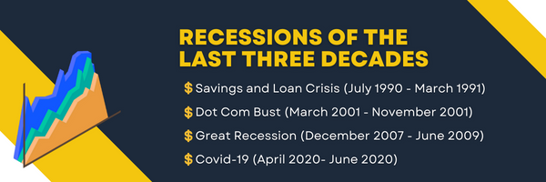

# Recession Investment Strategy


This is a multi-function jupyter lab notebook (stored as **Recession_Investment_Strategy.ipynb**) that compares investment returns from the previous four recessions across multiple indexes. As we enter a recession in 2022 it is a pertinent time to look at previous recessions to plan for the future. In this notebook we hope to answer the following questions:

* Which investment sectors performed the best in each recession period?
* Does the current market resemble any of the recession periods analyzed? 
* What part of the recession are we in, are we in the middle, bottom or on our way to recovery?
* Which investment sector is recommended to invest in based on best performance (return and speed) after the recession year end?
* Looking forward to 2023 (recession) should we adjust our investment strategy?


---

## Technologies

This project leverages python 3.7 with the following packages:

* [pandas](https://github.com/pandas-dev/pandas) 

* [hvplot](https://github.com/holoviz/hvplot) 

* [yfinance](https://github.com/ranaroussi/yfinance)

* [matplotlib](https://github.com/matplotlib/matplotlib)

* [sqlalchemy](https://github.com/sqlalchemy/sqlalchemy)
---

## Installation Guide

Before running the application first install the following dependencies.

```python
  pip install pandas
  pip install hvplot
  pip install yfinance --upgrade --no-cache-dir
  pip install SQLAlchemy
  python -m pip install -U pip
  python -m pip install -U matplotlib
```

---

## Usage


---

---

## Contributors

Brought to you by:
* Erick Esparza: [email](erickuh98@gmail.com) & [LinkedIn](https://www.linkedin.com/in/erick-esparza/)
* Leo Khodel: [email](lkhodel@gmail.com) & [LinkedIn](https://www.linkedin.com/in/lkhodel)
* Liz Maria Panza: [email](liizmaria_@live.com) & [LinkedIn](www.linkedin.com/in/liizmaria)
* Quianna Rolston: [email](quiannarolston@gmail.com) & [LinkedIn](https://www.linkedin.com/in/quianna-rolston)
* Zehra Vahidy: [email](zehra.vahidy@gmail.com) & [LinkedIn](www.linkedin.com/in/zehra-vahidy)

---

## License

UC Berkeley Extension
Fintech Bootcamp '22
